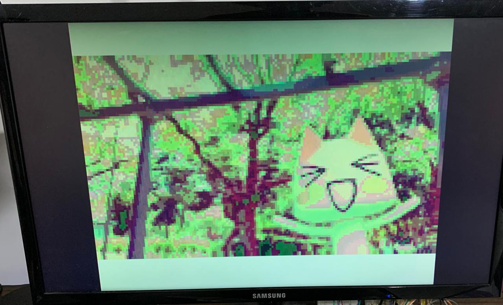
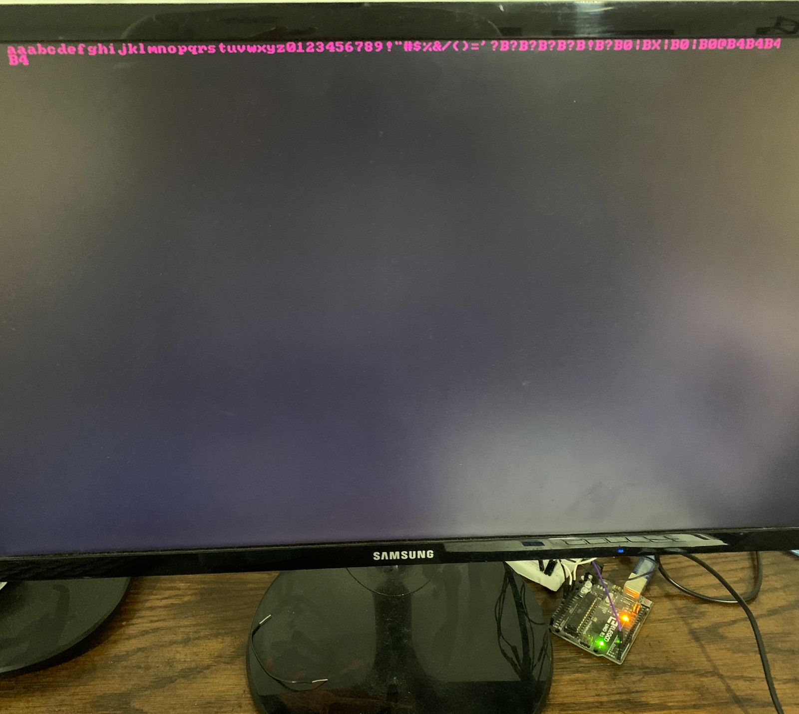

VGA module written in vhdl.

The vga entity has the following inputs:
- vga_clk: Pixel clock that drives the vga module

And the following outputs:
- **h_visible**: This line is held high when the pixel count is still within the visible area, once it exceeds the visible area this line is pulled low.
- **v_visible**: Same as h_visible, but with the line counting module. If the line count is within the visible area, this line is held high, otherwise it is pulled low.
- **px_count**: This vector contains the actual pixel count. The count is reset once it reaches the value set in PX_RESTART_COUNT.
- **ln_count**: Same as px_count but for lines instead of pixels. Once the count reaches the values set in LN_RESTART_COUNT the count is reset.
- **hsync**: Horizontal sync line. The timing for this line can be modified with the generics that are prefixed by HS_.
- **vsync**: Vertical sync line.The timing for this line can be modified with the generics that are prefixed by VS_.

You may notice that the module contains no RGB lines. This is so that if it is desired to add some sort of memory module, the data bus of that memory module drives the RGB lines, instead of them being driven from within the vga module. The px_count and ln_count lines are exposed as well because of this; if there is the need to add a memory module, these lines can be used for addressing.

The examples folder contains a few a examples of how one may use this module. I implemented them using gowin's IP Core, but you could replace these components with your board's IP Core.

## Scripts
This repo contains as well a few utility scripts that might come in handy.
- **bmp_to_mi.lua** is a Lua script that given a bmp image converts it to a memory initialization file. The addresses are in hex, as well as the contents of the address.
- **random_pop.lua** is a Lua script that will fill the file "rom.img" with ascending hex numbers, according to the memory depth.
- **tograyscale.lua** is a Lua script that converts a 16-bit-color bmp file to a black and white bmp file.

## Images
The images folder contains a few .mi files for rom/ram initialization.

## BMPs
The BMPs folder contains a bunch of 16 bit bmp images. These were exported using GIMP.

## Examples at work
## rom_vga

Iconic videogame creature, Toro, brutally resized to a 160x120 resolution and bit crushed to a 16-bit color format.

## serial_vga

Video output of serial information sent through my laptop to the fpga using an Arduino UNO as a usb-serial converter.

